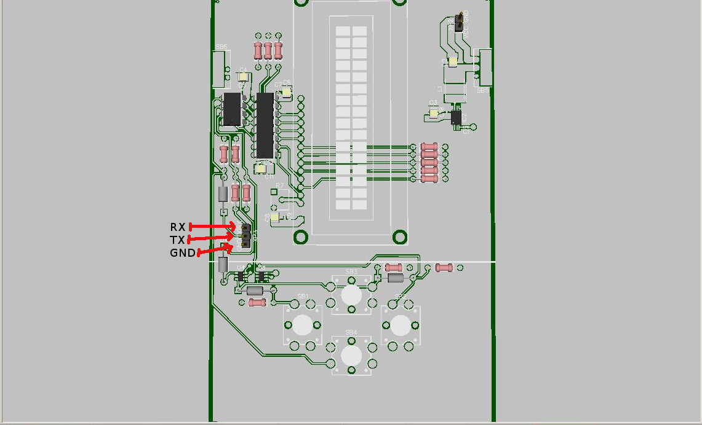
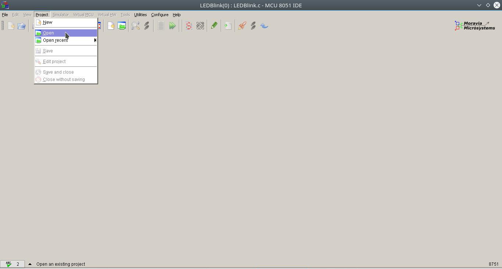
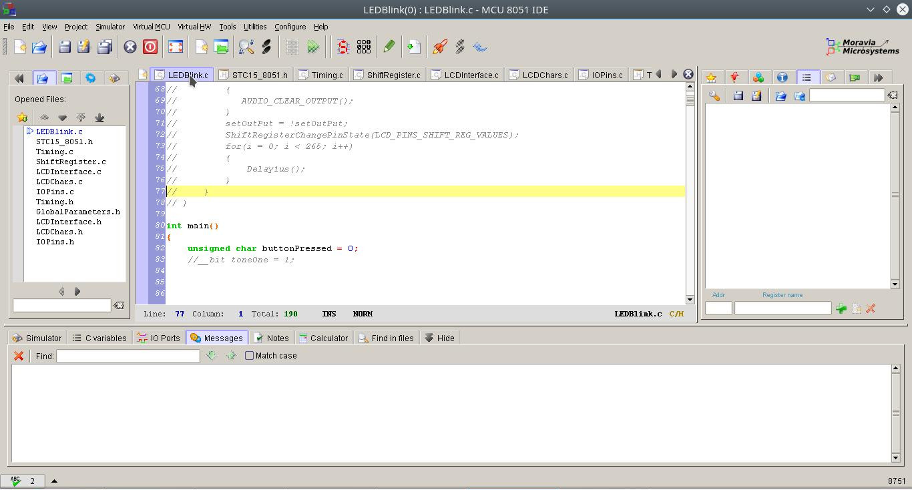
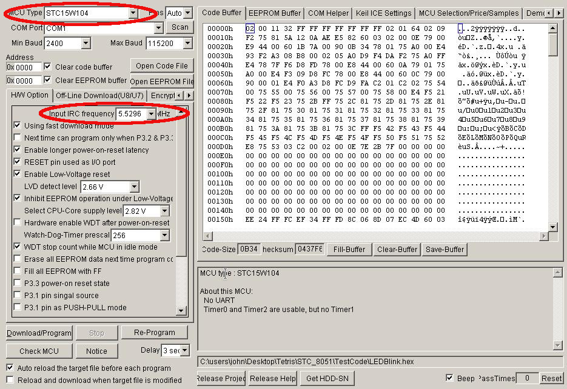
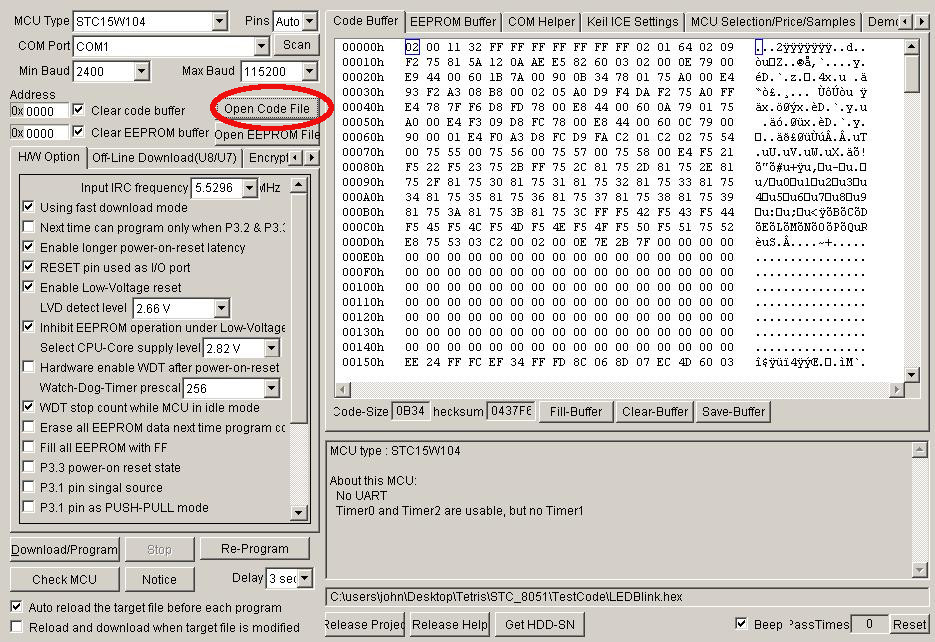
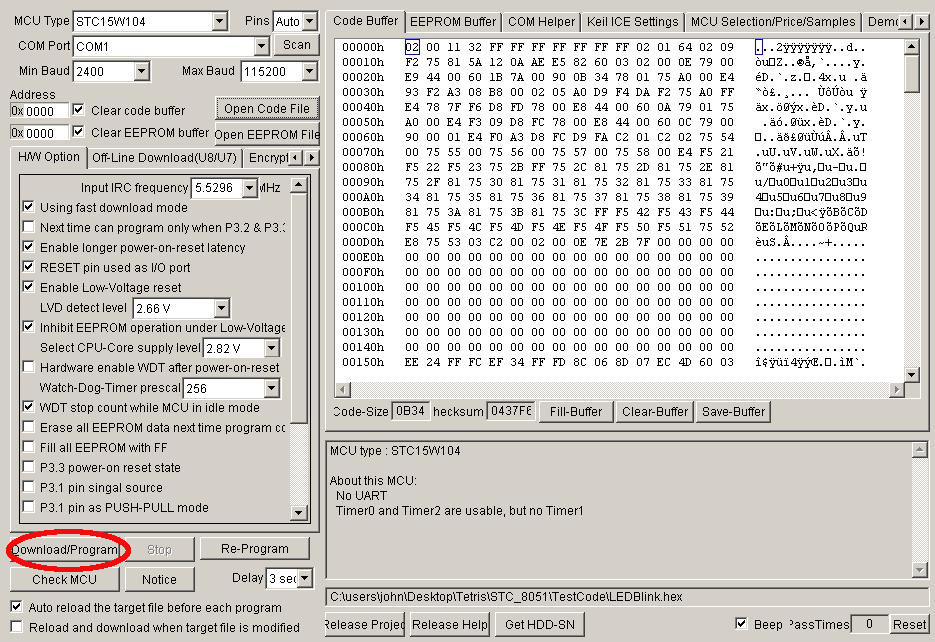

# Installation

1. IDE and Compiler
* Compiler_And_IDE/mcu8051ide-1.4.9-setup.exe
* Compiler_And_IDE/sdcc-3.5.0-setup.exe

2. UART Dongle Driver
* UART_Dongle_Driver/PL2303/PL2303_Prolific_DriverInstaller_v1180B.zip

3. Programming(Flashing) Software
* Programmer/stc-isp-15xx-v6.86D.exe

# UART Addapted to Board Connection

# Compilling and Programming
1. Download code from here [https://github.com/JohnDavisSmith/LCD_TTRS](https://github.com/JohnDavisSmith/LCD_TTRS).

2. In the MCU 8051 IDE open the project file found under the "Code/LEDBlink(0).mcu8051ide" in the downloaded sources:

3. Once the project is open select the LEDBlink.c file and press F11 to compile the project:

4. The successful compilation will produce a file called "LEDBlink.hex".

5. Configure the programming software:

6. Open the file from step 4) via the programming software:

7. Click on "Download/Program" in the programming software:

